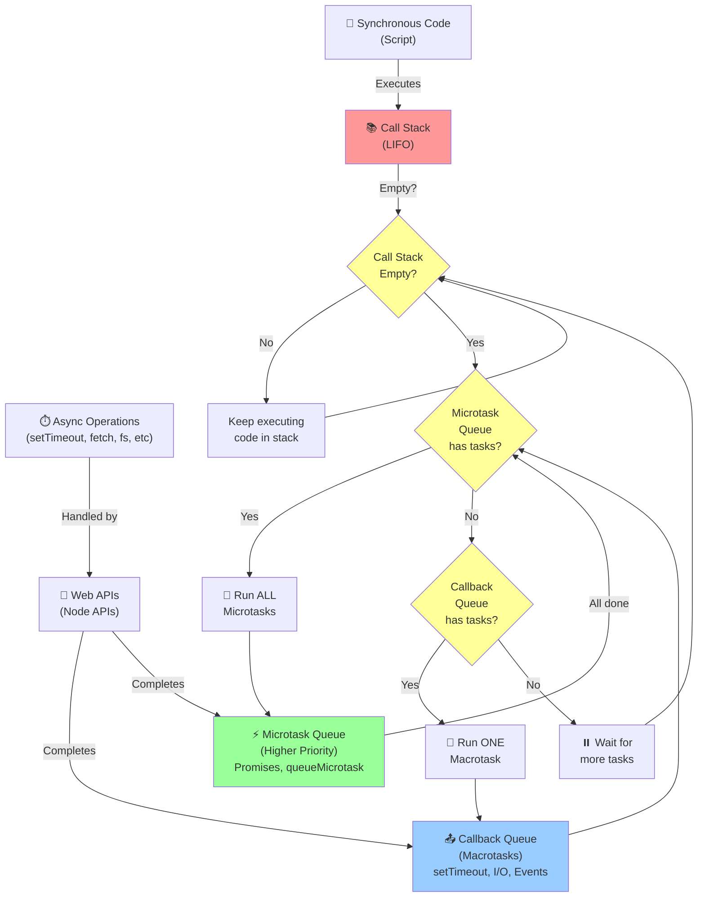

# Event Loop

> 📅 **Day 6** · ~15 min read · the single most-asked async question

JS is **single-threaded** but non-blocking thanks to the event loop.

## Definition

The **Event Loop** is a mechanism that enables JavaScript to perform non-blocking asynchronous operations despite being single-threaded. It continuously monitors the call stack and callback queues, pushing queued callbacks to the call stack when it becomes empty. This allows JavaScript to handle time-consuming operations (like network requests, file I/O, timers) without blocking the main thread, ensuring the UI remains responsive and the application can handle multiple operations concurrently.

## Flow

The event loop follows a continuous cycle of execution:

1. **Execute Synchronous Code** — All synchronous code runs on the call stack from top to bottom (LIFO order).

2. **Check Call Stack** — The event loop continuously checks if the call stack is empty.

3. **Process Microtasks** — When the call stack is empty, the event loop drains the **entire** microtask queue before any macrotask:
   - Promise `.then()`, `.catch()`, `.finally()`
   - `queueMicrotask()`
   - `MutationObserver`

4. **Process One Macrotask** — After all microtasks are complete, the event loop picks **one** task from the macrotask queue:
   - `setTimeout` / `setInterval`
   - I/O callbacks
   - DOM events
   - `setImmediate` (Node.js)

5. **Repeat** — After executing one macrotask, the event loop returns to step 3 (drain all microtasks again) before picking the next macrotask.

**Key Flow Rule:** After each macrotask completes, the entire microtask queue is emptied before the next macrotask runs. This ensures high-priority tasks (Promises) are handled as soon as possible.

## Architecture — Components at a Glance

```
┌──────────────────────────────────────────────────────────────────────┐
│                        BROWSER / NODE.js RUNTIME                     │
│                                                                      │
│  ┌─────────────────┐        ┌──────────────────────────────────────┐ │
│  │   Call Stack    │        │        Web APIs / Node APIs          │ │
│  │  (single thread)│        │                                      │ │
│  │                 │──────▶ │  setTimeout │ fetch │ fs │ DOM Events│ │
│  │  fn3()  ← top   │ async  │                                      │ │
│  │  fn2()          │  ops   └────────────────────┬─────────────────┘ │
│  │  fn1()          │                             │ done? push cb     │
│  │  global()← base │                             │                   │
│  └────────┬────────┘                             │                   │
│           │                          ┌───────────▼──────────────┐    │
│    empty? │                          │  ⚡ Microtask Queue       │    │
│           │                          │  Promise.then/catch       │    │
│           ▼                          │  queueMicrotask           │    │
│  ┌────────────────┐                  │  MutationObserver         │    │
│  │  Event Loop    │◀── drain ALL ────┤──────────────────────────┤    │
│  │                │                  │  📤 Macrotask Queue       │    │
│  │  (tick cycle)  │◀── pick ONE  ────│  setTimeout / setInterval │    │
│  └────────┬───────┘                  │  I/O callbacks / Events   │    │
│           │                          └──────────────────────────┘    │
│           │ push callback onto stack                                  │
│           └──────────────────────────────────────────────────────▶   │
└──────────────────────────────────────────────────────────────────────┘
```

## How the Event Loop Works



## Priority Flow Diagram

```
Single Thread Execution Order:
═══════════════════════════════════════════════════════

1️⃣  SYNCHRONOUS CODE (top of call stack)
    ↓
2️⃣  ALL MICROTASKS (after sync code, before any macrotask)
    └─ Promises (.then/.catch/.finally)
    └─ queueMicrotask()
    └─ MutationObserver
    ↓
3️⃣  ONE MACROTASK (from callback queue)
    └─ setTimeout
    └─ setInterval
    └─ I/O operations
    └─ DOM events
    ↓
4️⃣  Back to Step 2️⃣ (ALL MICROTASKS again)
    ↓
5️⃣  Next MACROTASK...
    
⚠️  KEY RULE: 
After EACH macrotask, the ENTIRE microtask queue is drained
BEFORE the next macrotask runs!
```

## Pieces
- **Call Stack** — runs synchronous code (LIFO).
- **Web APIs / Node APIs** — handle async work (timers, fetch, fs, DB).
- **Callback (Task / Macrotask) Queue** — `setTimeout`, `setInterval`, I/O, DOM events.
- **Microtask Queue** — Promise `.then/.catch/.finally`, `queueMicrotask`, `MutationObserver`. **Higher priority.**
- **Event Loop** — when the call stack is empty, it drains **all microtasks first**, then **one macrotask**, repeat.

## Priority rule (key!)
After each macrotask, **the entire microtask queue is emptied** before the next macrotask.

## Classic output question
```js
console.log("1 start");

setTimeout(() => console.log("2 timeout"), 0);   // macrotask

Promise.resolve().then(() => console.log("3 promise")); // microtask

console.log("4 end");

// Output:
// 1 start
// 4 end
// 3 promise   ← microtask runs before timeout
// 2 timeout
```

## Harder one
```js
console.log("A");
setTimeout(() => console.log("B"), 0);
Promise.resolve().then(() => {
  console.log("C");
  setTimeout(() => console.log("D"), 0);
});
Promise.resolve().then(() => console.log("E"));
console.log("F");

// A, F, C, E, B, D
// sync: A, F
// microtasks: C, E   (C schedules timeout D)
// macrotasks: B, then D
```

## Why JS is Non-Blocking

JS has **one call stack** — it can only do one thing at a time. Without async, every slow operation (network, disk, timer) would **freeze** the entire thread. The event loop solves this:

```
  Blocking world (no event loop)         Non-Blocking JS (event loop)
  ─────────────────────────────          ──────────────────────────────
  read file  ──▶ 😴 wait 200ms           read file ──▶ Web API handles it
  fetch data ──▶ 😴 wait 300ms           fetch     ──▶ Web API handles it
  render UI  ──▶ 😰 still frozen         render UI ──▶ runs NOW ✅
  ...UI is unresponsive...               ...callbacks arrive when ready...
```

**Key insight:** async tasks are **offloaded** to the browser/Node environment (Web APIs). The call stack stays free, so JS keeps executing. When the async work finishes, the callback is queued and the event loop picks it up **between tasks**.

```
Step-by-step tick:
──────────────────
① Execute all sync code on the call stack
② Call stack empty → event loop kicks in
③ Drain ENTIRE microtask queue (all Promises)
④ Pick ONE macrotask (e.g. setTimeout callback)
   └─ push it onto the call stack & run it
⑤ After that macrotask → drain microtasks again
⑥ Repeat ④ until all queues are empty → idle wait
```

## Node.js specifics
Node's loop has phases: **timers → pending → poll → check (setImmediate) → close**.
- `process.nextTick()` runs **before** other microtasks (even Promises).
- `setImmediate` vs `setTimeout(0)` order can vary, but inside an I/O callback `setImmediate` runs first.

```js
process.nextTick(() => console.log("nextTick"));
Promise.resolve().then(() => console.log("promise"));
// nextTick → promise
```

---

## Common interview questions
1. **What is the event loop?** → Mechanism that moves queued callbacks to the stack when it's empty, enabling async in a single thread.
2. **Microtask vs macrotask?** → Promises (micro) run before setTimeout (macro).
3. **`setTimeout(fn, 0)` runs immediately?** → No, after current sync + all microtasks.
4. **`process.nextTick` vs Promise?** → nextTick fires first in Node.
